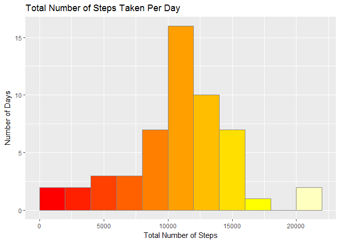
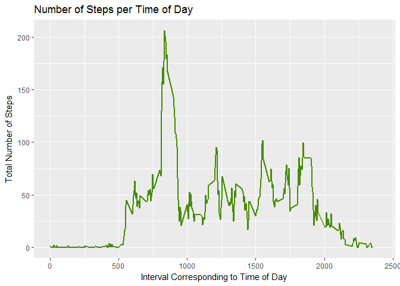
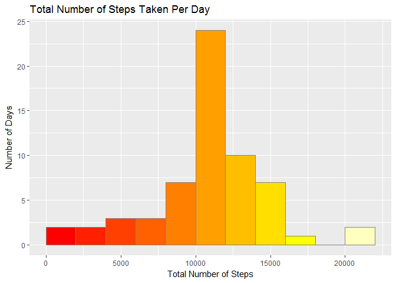
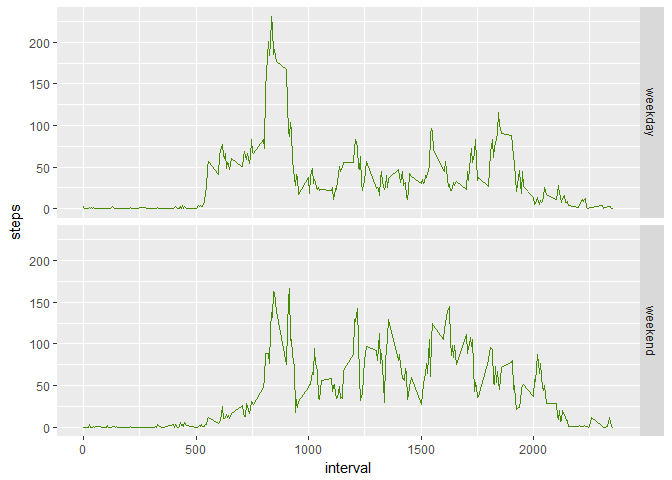

# Reproducible Research: Peer Assessment 1


## Loading and preprocessing the data

*Load the data (i.e. read.csv()); process/transform the data (if necessary) into a format suitable for your analysis:*


```r
library(dplyr, quietly = TRUE, warn.conflicts = FALSE)
setwd("C:/Users/Ian/Desktop/DataScience")
activity <- read.csv("./data/activity.csv")
daily <-
        activity %>%
        group_by(date) %>%
        summarise(steps = sum(steps)) %>%
        data.frame()
timeofday <-
        activity[!is.na(activity[,1]),] %>%
        group_by(interval) %>%
        summarise(steps = mean(steps))
```

## What is mean total number of steps taken per day?

*Make a histogram of the total number of steps taken each day:*


```r
library(ggplot2, quietly = TRUE, warn.conflicts = FALSE)
```

```
## Warning: package 'ggplot2' was built under R version 3.3.2
```

```r
ggplot(daily, aes(steps)) + 
        geom_histogram(breaks = seq(0, 22000, by = 2000), na.rm = TRUE, 
                       fill = heat.colors(11), col = "grey52") +
        labs(x = "Total Number of Steps", y = "Number of Days", 
             title = "Total Number of Steps Taken Per Day")
```

<!-- -->

*Calculate and report the mean and median of the total number of steps taken per day:*


```r
men <- as.integer(round(mean(daily$steps[!is.na(daily$steps)])))
med <- median(daily$steps[!is.na(daily$steps)])
```

The mean number of steps taken per day is **10766** and the median is **10765**

## What is the average daily activity pattern?

*Make a time series plot (i.e. type = "l") of the 5-minute interval (x-axis) and the average number of steps taken, averaged across all days (y-axis):*


```r
ggplot(timeofday, aes(interval, steps)) + 
        geom_line(lwd = 1, col = "chartreuse4") +
        labs(x = "Interval Corresponding to Time of Day", y = "Total Number of Steps",
             title = "Number of Steps per Time of Day") +
        coord_cartesian(xlim = c(0,2400))
```

<!-- -->

*Which 5-minute interval, on average across all the days in the dataset, contains the maximum number of steps?*


```r
most <- as.double(timeofday[which(timeofday$steps == max(timeofday$steps)),1])
```

The 5-minute interval which contains the max number of steps is **835**

## Imputing missing values

*Calculate and report the total number of missing values in the dataset (i.e. the total number of rows with NAs):*


```r
miss <- sum(is.na(activity))
```

Total missing values: **2304**

*Devise a strategy for filling in all of the missing values in the dataset:*
Missing values will be replaced with the mean number of steps for that paricular interval


```r
activity2 <- activity
activity2$steps <- replace(activity$steps, is.na(activity$steps), timeofday$steps)
```

*Create a new dataset that is equal to the original dataset but with the missing data filled in:*


```r
daily2 <-
        activity2 %>%
        group_by(date) %>%
        summarise(steps = sum(steps))
```

*Make a histogram of the total number of steps taken each day:*


```r
ggplot(daily2, aes(steps)) + 
        geom_histogram(breaks = seq(0, 22000, by = 2000), na.rm = TRUE, 
                       fill = heat.colors(11), col = "grey52") +
        labs(x = "Total Number of Steps", y = "Number of Days", 
             title = "Total Number of Steps Taken Per Day")
```

<!-- -->

*Calculate and report the mean and median total number of steps taken per day:*

The mean with NAs is: **10766** and the median w/NAs: **10765**  
The mean w/o NAs is: **10766** and the median w/o NAs is: **10766**

*Do these values differ from the estimates from the first part of the assignment?*  
Not particularly.

## Are there differences in activity patterns between weekdays and weekends?

*Make a panel plot containing a time series plot (i.e. type = "l") of the 5-minute interval (x-axis) and the average number of steps taken, averaged across all weekday days or weekend days (y-axis):*


```r
activity2$date <- strptime(as.character(activity2$date), format = "%Y-%m-%d")
activity2$weekday <- weekdays(activity2$date)
weekdaylogical <- activity2$weekday == "Saturday" | activity2$weekday == "Sunday"
activity2$weekday <- replace(activity2$weekday, weekdaylogical, "weekend")
activity2$weekday <- replace(activity2$weekday, !weekdaylogical, "weekday")
activity2$weekday <- as.factor(activity2$weekday)
activity2$date <- as.Date(activity2$date)
activity3 <-
        activity2 %>%
        group_by(weekday, interval) %>%
        summarise(steps = mean(steps))
ggplot(activity3, aes(interval, steps)) +
        geom_line(col = "chartreuse4", lwd = 0.6) + 
        facet_grid(weekday~.)
```

<!-- -->

